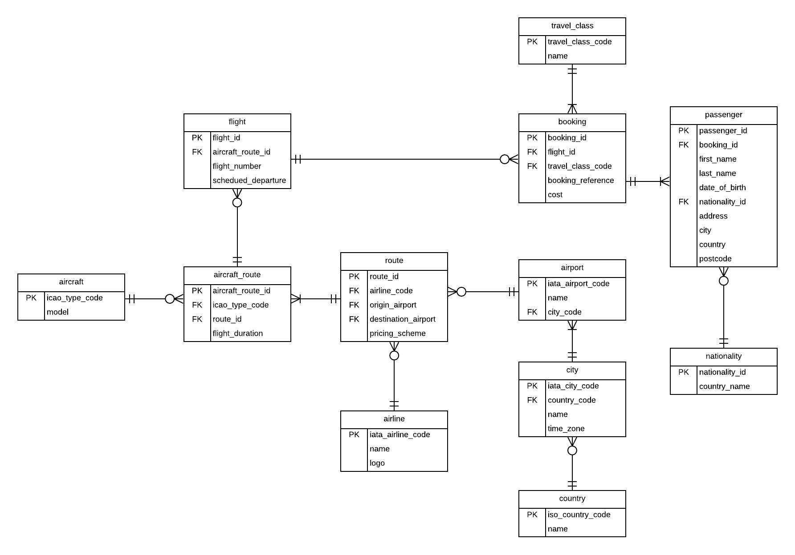
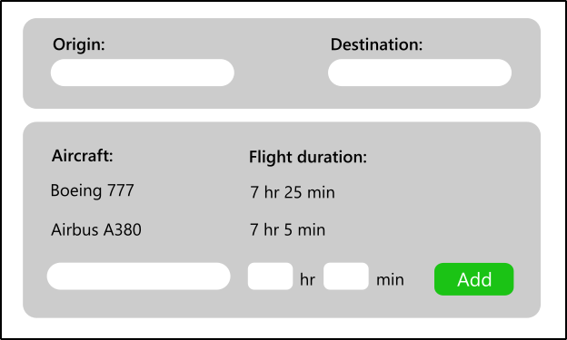
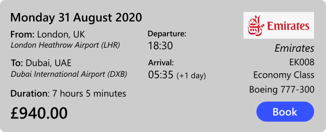

# Right Flight - Individual Project

## Sprint 1

### Review

For this project, the decision was made to follow a database-first approach. This is because the database-first approach affords more flexibility with regards to database design, and only an intermediate knowledge of SQL is required in order to leverage the powerful features of relational databases. Accordingly, the first sprint began with the development of the database schema for the project and the creation of an entity-relationship diagram. Using this, a SQL Server database was created and populated with essential data, such as names of countries, cities and airports. The entity-relationship diagram for the database is shown below.

Creation of the database required some research into appropriate representation for time zone information which could be both easily stored in the database, as well as exploited in a C# program. The decision was made to use the Windows time zone database, which is stored in the Windows operating system registry. This database can by interrogated by .NET Core in order to obtain time zone information for a given region, including details of daylight savings time. In order to do this, the key for the time zone must be known. The key is a string describing the database, for example ''Pacific Standard Time". Therefore, it was decided to store the time zone key for each city in the database so that this information could be used at run time.

The database context was then scaffolded and C# entity model classes were created in order to facilitate interoperation with the database.

Following this, the layout and appearance of user interface screens was designed. Below are two examples of UI mock-ups which were created.

The first user interface screen to be developed was the screen which allows users to add routes to the database. This screen includes a search box with live suggestions. As such a control is not part of WPF as standard, a custom control had to be created. Much of the remainder of the sprint was then dedicated to implementing the user control, and addressing the associated technical challenges. 

Once the user control had been fully implemented, the user interface for adding routes was then partly developed. However, the interface for this particular page was not implemented in its entirety. Features for selecting the airline, origin and destination airports, as well as the aircraft flying the route were implemented. However, the user also needs to be able to enter detailed pricing information, and a form for entering this information still needs to be implemented. This will be done in the following sprint.

### Retrospective

Creation of the database schema was completed efficiently and in good time. This is because the finer details of the database design had been considered in advanced and difficulties had been planned for. However, some difficulties were unforeseen and required additional research. For example, storing time zone information in an appropriate format which could be leveraged at runtime was a difficulty which had not been identified in advance. The second major impediment in this sprint was the requirement for a search box which provides live suggestions. Foresight and prior research into potential technical challenges could have mitigated the time lost to these tasks.

## Sprint 2

### Review

During this sprint, work continued on the feature which had been started during sprint 1, namely the ability to add routes to the database and the development of the associated user interface. This feature was successfully completed by the end of the sprint and passed functional testing criteria.

The application now includes a screen which allows the user (airline or travel agent) to input details of a route flown by an airline. The user is able to select an airline, an origin airport, and a destination airport. The selection of these details is aided by a search suggestion feature so that the user does not have to find their desired option in a long list. They can instead type in a search term and be provided with options which match their search term. This makes the application more user friendly. In addition, when searching for an airport, two features are available to assist the user in their search. Firstly, the user can search using IATA airport codes (eg LAX) instead of the airport name. They can also enter the name of the city served by an airport in order to retrieve it in the search. This is useful when the name of the airport does not include the city, eg "McCarthy International Airport" in Las Vegas.

The user is also able to specify which aircraft fly the route and the expected flight duration for each type of aircraft. This covers the possibility where multiple aircraft fly the same route but have different flight times. The user can also specify the pricing scheme for the route. They are able to specify which travel classes (economy, first, etc) are available on the route, as well as a pricing breakdown by age group for each travel class. This feature has been implemented in this way because not all airlines will offer all travel classes - some may offer economy and business, but not first, for example, and some may only offer first class on certain routes. This feature allows then to specify the pricing scheme of only the travel classes which are available on the given route. If the user makes a mistake and enters incorrect information for either one of the aircraft or one of the travel classes, they are able to remove it from the list by clicking a button.

Data validation and error checking associated with this feature have also been implemented. The user is prevented from entering null values into the database. In addition, they may not add a route where the origin and destination airport are the same. They may not add a combination of airline, origin and destination which already exists in the database. They may not add the same aircraft twice for the same route, or the same travel class twice, and they may not enter a value greater than 59 for the minutes part of the flight duration.

### Retrospective

This sprint was generally considered a success and was completed without any major hurdles. A major feature was successfully implemented and passed functional testing criteria.

It was noted that the development of a user-friendly and modern-looking user interface was a potentially time-consuming endeavour. Although this is not currently an issue, in future sprints, it may become necessary to forego some aspects of the interface in order to ensure that the minimum viable product is delivered.

In addition it was noted that the feature being implemented in this sprint should have been identified as an epic rather than just a single user story. Although the feature represents a single unit of functionality, it encompasses many potential user stories. For example, being able to find an airport by searching for the city it serves could be a whole user city in its own right. It was decided in future to give more focus to breaking down larger user stories into finer-grained ones.

## Sprint 3

### Review

The main goal for this sprint was the development of a page which would enable users to add flights to the database. This goal was successfully completed by the end of the sprint, and passed functional testing criteria.

The application now features a page which allows users to perform the task of adding flights to the database. Users can search for routes by using two search bars at the top of the page. One is for inputting the airline running the  route, and the second is to input one of the airports served by the route. This will narrow down the total number of routes stored in the database to a small number, which can be displayed in a list box. The user should then find it straightforward to select a route from the list box, having narrowed down the number of options. The page also has fields which allow the user to enter the  date of the flight, the scheduled time of departure and the flight number. There is also a combo box to allow the user to select the aircraft used for the fight. Using this combo box, the user is only allowed to select aircraft which have been assigned to the route. Once the user has entered the details, they can click a button at the bottom of the page to confirm.

### Retrospective

This sprint was considered a success and was completed without any major hurdles. The decision was made during this sprint to forego the creation of detailed UI mock-ups for every single view. Creating a mock-up was considered to be a time-consuming and labour-intensive task for which not enough man-hours were available. Furthermore, it did not add value to the product. The user interface design could instead be sketched out roughly on a sheet of paper prior to development. This was a more effective design activity which provided enough information for the developer to assess how the concept would be realised and was much more time-efficient.

## Sprint 4

### Review

The main goal for this sprint was the development of a page which allows users to search for flights. This goal was successfully completed by the end of the sprint and passed functional testing criteria.

In order to realise this goal, additional CRUD functionality and business logic had to be developed. In particular, the required CRUD functionality involved retrieving flight information from numerous table and using this to populate models suitable for consumption by the view layer. In terms of business logic, a method had to be written to calculate ticket prices for a particular flight given the number of passengers, their age categories, and the pricing scheme for the flight. In addition, a method had to be written to calculate arrival time, given a flight's departure time, its duration, and the time zone IDs of the origin and destination cities. 

The application now features a page which allows users to search for flights. The page has two search bars at the top, one to enter the city the customer wants to fly from, and one for the city they want to fly to. The search functionality allows the user to search by city name rather than airport. In the case where one city is served by more than one airport, this enables the user to find all flights which run between two locations, regardless of which airport is involved. At this stage the user can also specify the number of passengers on the flight, broken down by age category into adults, children and infants. This enables the search to provide ticket prices straight away.

When the user clicks the search button, a list of flights is displayed in chronological order. Each flight is displayed in a separate box and all pertinent information about the flight is displayed in its box. This includes the date of the flight, the city and country of origin, the destination city and country, the origin and destination airports and their IATA codes, the flight duration, departure time, arrival time, airline, flight number and aircraft type. In addition, all travel classes available on each flight and the corresponding ticket prices for the number of passengers selected are shown. If the user would like to book one of these flights, there is a "book" button for each flight, which they can click on. The booking functionality will be completed in the following sprint.

### Retrospective

This sprint was considered a success and was completed without any major obstacles. However, it was noted that the need (real or perceived) to demonstrate a tangible, functioning product at the end of each sprint, and to have made visible progress, was leading to a rushed working style and a decline in prior planning and forethought. There is a real danger that this could lead to poor code quality, which would impact the extensibility and maintainability of the product. In order to tackle this problem, it was decided to dedicate at least half of the final sprint purely to code refactoring. In order for this to occur, the minimum viable product must be complete before then.

## Sprint 5

### Review

The goal for this sprint was to develop a page for making bookings, and to create a home page for the application. In addition, navigation would be implemented between the application's various pages. This was all successfully implemented, and all features passed functional testing criteria.

In order to enable navigation, the architecture of the view layer needed to be extended. A page controller class was created which was responsible for injecting view models into pages, and directing the main window to navigate to a new page when necessary.

The application now features a booking page, which can be accessed by clicking on the "book" button when searching for flights. The flight details are displayed at the top of the page, in a similar fashion to the search page. There is a drop down box by the flight details which allows the user to select their desired travel class. The ticket price is then displayed underneath and is updated based on the selected travel class. Underneath the flight details, there are forms in which passenger details can be entered. Each passenger has their own form in a box, which consists of fields to enter the passenger's name date of birth, nationality and address details. At the bottom of the page, there is a "confirm" button which the user can click on when they have finished entering passenger details. This will finalise the booking, enter it into the database, and inform the user of the booking reference.

The application also features a home page. The home page features three buttons which are used to navigate to the search page, the "add route" page, and the "add flight" page. Other pages also feature "cancel" or "home" buttons which can be used to navigate back to the home page.

### Retrospective

This sprint was successful and completed without any impediments. The minimum viable product is now complete, and therefore, the final sprint will focus on unit testing and code refactoring.

It has been noted that leaving unit testing to the end is generally a precarious path - if bugs are discovered in the final sprint, this leaves little time to correct them. In future projects, it would be ideal to conduct unit testing in tandem with development, possibly using TDD.

## Sprint 6

### Review

The final sprint focused on unit testing and code refactoring. Unit tests were created for CRUD functionality as well as other aspects of business logic, such as calculating ticket prices and arrival times. The CRUD functionality tested included the method used to add routes as well as the method used to add flights. The method used to calculate arrival times was tested under various scenarios, such as origin and destination cities being in the same time zone, the destination time zone being ahead of the origin time zone, the destination time zone being behind the origin time zone, a flight arriving the day after departing, and flights on dates where one or both of the origin and destination were observing daylight savings time. All unit tests passed and therefore there was no need to correct any bugs.

Code refactoring focused on ensuring that mechanisms used to pass data between the view layer and business layer were consistent across all views, and that the view layer did not have access to irrelevant data or data that should be kept private.

### Retrospective

This sprint was a success as the code passed all unit tests and there were no major obstacles. However, it was noted during the code refactor that the business layer violates some principles of object-oriented programming, most notably the single responsibility principle. Although some functionality is delegated to static helper classes, most of the functionality in the business layer is performed by one class, known as the `CrudManager`. The name of this class would suggest that its functionality should be limited to database CRUD operations. However, it is also responsible for converting data into a form which is suitable for the view. This conflation of responsibilities could prove problematic if the project were to be expanded in its scope. In future, better analysis of responsibilities and class design is required prior to development to ensure this does not occur.

## Project Retrospective

In general, the project was a success, and the minimum viable product has been successfully developed. A few things are worth noting. Firstly, there was a trade-off to be made between having a modern and intuitive user interface and having the time to develop additional functionality, such as being able to view and cancel existing bookings. As having a modern and intuitive interface was one of the project goals, additional functionality had to be sacrificed. Secondly, it was noted that the perceived pressure of having a tangible product to demonstrate at the end of each sprint led to a rushed working style, which meant a decline in the focus on code quality. In future, there should be a greater emphasis placed on code quality, and having less functionality to demonstrate at the end of the sprint should be considered an acceptable trade-off.